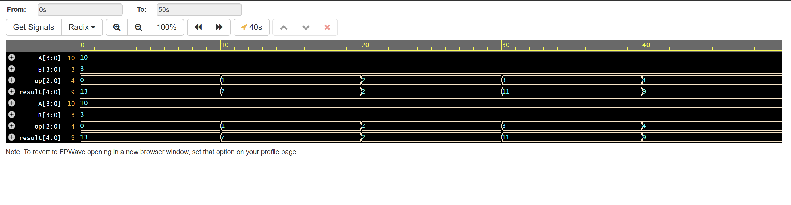
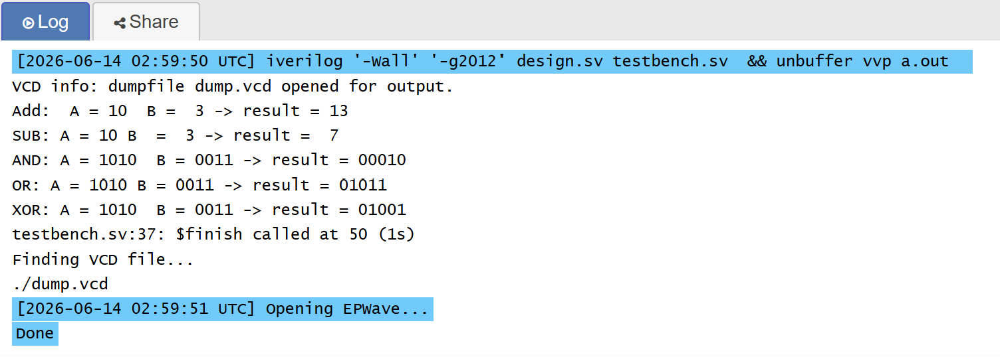

# 🖥️ 4-bit ALU in Verilog

> RTL design · 5 arithmetic/logic operations · 
> Testbench verification · EPWave waveforms

---

## 📊 Results

### EPWave Waveform — All 5 Operations

### Simulation Output

---

## ✨ What it does

Implements a 4-bit Arithmetic Logic Unit with 5 operations
selected by a 3-bit opcode:

| Opcode | Operation | A=10, B=3 | Result |
|--------|-----------|-----------|--------|
| 3'b000 | ADD | 10 + 3 | 13 ✅ |
| 3'b001 | SUB | 10 - 3 | 7 ✅ |
| 3'b010 | AND | 1010 & 0011 | 00010 ✅ |
| 3'b011 | OR  | 1010 \| 0011 | 01011 ✅ |
| 3'b100 | XOR | 1010 ^ 0011 | 01001 ✅ |

---

## 🧠 Key Verilog Concepts

| Concept | Implementation |
|---------|---------------|
| Module | alu_4bit — box with 3 inputs, 1 output |
| always @(*) | Combinational block — reacts to any input change |
| case statement | Selects operation based on 3-bit opcode |
| reg vs wire | result is reg — assigned inside always block |
| Testbench | Separate module that feeds inputs and checks outputs |
| $display | Prints results — like Python's print() |
| $dumpvars | Generates VCD file for EPWave waveform viewer |

---

## 📁 Files

| File | Description |
|------|-------------|
| design.sv | ALU module — RTL implementation |
| testbench.sv | Testbench — stimulus and verification |

---

## ▶️ How to Run

Open on EDA Playground (free, browser-based):
[👉 Click here to open and run]([(https://edaplayground.com/x/SmDv)])

Settings:
Language  : SystemVerilog/Verilog

Simulator : Icarus Verilog 12.0
Click **Run** — see results in Log tab and waveforms in EPWave.

---

## 🛠️ Tech Stack

Verilog HDL · Icarus Verilog · EPWave · EDA Playground

---

## 👩‍💻 Built by

**Aagya** — EEE/ECE Student @ Kathmandu University

